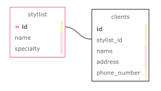

# Hair Salon

#### A basic webpage for a hair salon that allows the user to track stylists and clients that belong to each indivual stylist.

#### **By Shane Graff**

#### Table of Contents

1. [Technologies Used](#technologies)
2. [Description](#description)
3. [Setup/Installation Requirements](#setup)
4. [Known Bugs](#bugs)
5. [License](#license)
6. [Contact Information](#contact)

## Technologies Used <a id="technologies"></a>

* C#
* ASP.Net Core
* ASP.NET MVC
* [Entity Framework](https://docs.microsoft.com/en-us/aspnet/entity-framework)
* MySql Database

## Description <a id="description"></a>
Hair Salon is a web app for a fictious Hair Salon which utilizes the following table layout:



The application tracks the Stylists working for the salon, and the clients associated with each Stylist. A Stylist may have many Clients, but a client can only be associated with one Stylist. Users are allowed to add, delete, and edit the Stylists working for the salon and to add, delete, and edit the Clients that belong to each Stylist.

## Setup/Installation Requirements <a id="setup"></a>

1. If you don't already have C# and .NET installed on your computer, you can get the Software Develment Kit or SDK for Mac here: [Dot.Net for Mac](https://dotnet.microsoft.com/download/dotnet/thank-you/sdk-5.0.100-macos-x64-installer) and for Windows here: [Dot.Net for Windows](https://dotnet.microsoft.com/download/dotnet/thank-you/sdk-5.0). Follow the instructions detailed in both links above for set up.
2. If not already installed, download: [MySql Community](https://dev.mysql.com/downloads/mysql/)
3. If not already installed, download: [MySql Workbench](https://www.mysql.com/products/workbench/)
4. Follow the instruction [here](https://www.learnhowtoprogram.com/c-and-net-part-time-c-and-react-track/getting-started-with-c/installing-and-configuring-mysql) for configuring MySql. 
5. Open the terminal on your local machine and navigate to where you want to clone the project
6. Run the following command: git clone https://github.com/ShanGGraff/HairSalon.Solution
7. Follow these steps to import the table needed for the project:
* Determine if the MySql server is running locally by typing the following into the command line ```mysql -uroot -p[The password you set up]```
* Open MySql Workbench. Once open select the __Administration__ tab. Next select __Data Import/Restore__. This opens up the __Data Import__ window with the __Import from Disk__ tab open. Select the radio button for __Import from Self-Contained File__. Click the button with the three dots (if on windows) or two dots (if on mac) at the end of the path field. This will open a window to search for the sql dump file on your local disk. Navigate to the root directory of the cloned project and select __shane_graff.sql__ and click the __open__ buton. Next, press the __New...__ button. This will open a window where you can choose the name of the imported schema. Choose a name appropriate to the project, e.g. ```hairsalon``` and click __Okay__ We'll need this name later when setting up the project to work with this schema. If on a mac, click the __Start Import__ botton. If on a windows machine, switch to the __Import Progress__ tab on the __Data Import__ page. Click the __Import__ button. Finally, re-click on the __Schemas__ tab. Right-click in the __Schemas__ window, and select __Refresh All__. The imported schema should now be listed.
8. Navigate back to the ```HairSalon/``` directory and create a file named: ```appsettings.json```. In this file, add the folling configuration to set up the project to work with the schema you imported: 
```
{
  "ConnectionStrings": {
    "DefaultConnection": "Server=localhost;Port=3306;database=[THE-NAME-YOU-CHOSE-WHEN-IMPORTING-THE-SCHEMA];uid=root;pwd=[YOUR-PASSWORD-HERE];"
  }
}
```
9. In the HairSalon main directory run ```dotnet build``` on the command line
10. If everything builds correctly, run ```dotnet run``` on the command line to start the web server

## Known Bugs <a id="bugs"></a>
None known

## License
* [MIT](https://choosealicense.com/licenses/mit/)

Copyright (c) 2021 Creators 

## Contact Information <a id="contact"></a>

* Shane Graff <copellius@gmail.com>
* Github page: [ShanGGraff](https://github.com/ShanGGraff)
* LinkedIn: [Shane Graff](https://www.linkedin.com/in/shanegraff)
